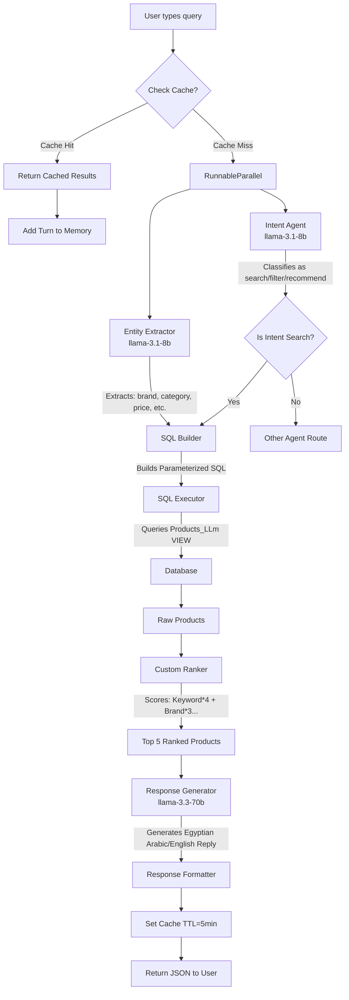
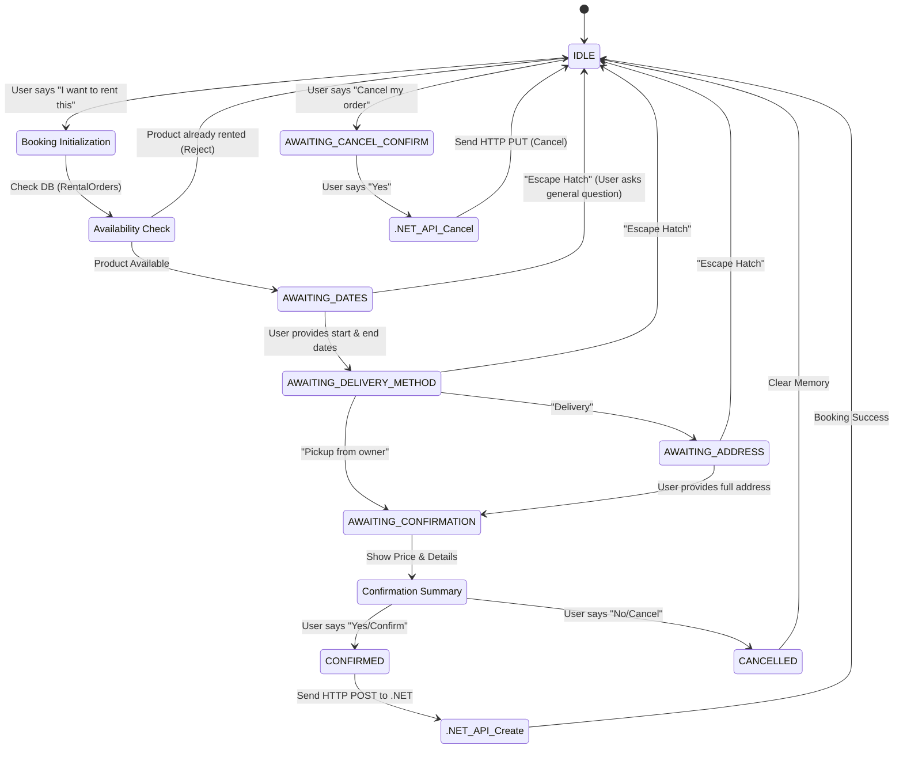
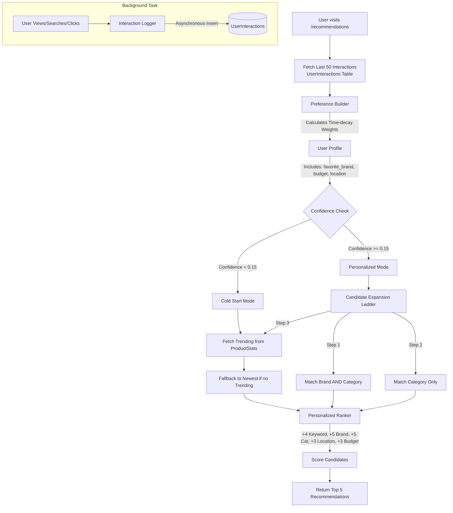

# AI Features Workflow Diagrams

ملف بيوضح تدفق العمليات (Workflows) الخاص بكل ميزة من مميزات الـ AI في المشروع بكل التفاصيل والاحتمالات الممكنة، باستخدام `mermaid` diagrams.

## 1. Smart Search Workflow

الرسمة بتوضح إزاي النظام بيتعامل مع أي استعلام بحث (Search Query) من لحظة دخول المستخدم لحد عرض النتائج:

---

## 2. End-to-End Chat Agent (Booking & Cancellation Flow)

الرسمة بتوضح الـ State Machine الخاصة بالحجز، وازاي النظام بيتابع حالة الحجز خطوة بخطوة مع المستخدم (Booking Context):

---

## 3. Personalized Recommendation System

الرسمة بتوضح الـ Recommendation Engine من وقت تجميع البيانات وحتى عرض اقتراحات للمستخدم (Personalized vs Cold-Start):

